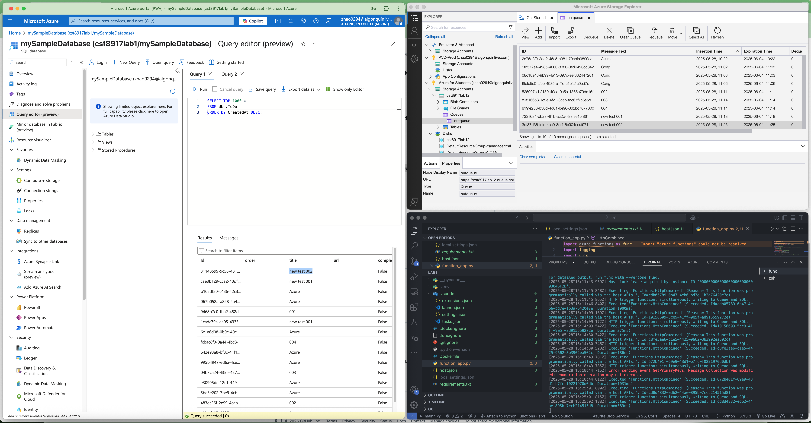

# CST8917lab1----Azure Function - Queue and SQL Dual Output (Python)

This project contains an Azure Function written in Python that uses a single HTTP trigger to simultaneously output to:

* An Azure Storage Queue
* An Azure SQL Database

## Project Structure

.
├── function_app.py       # Python function with queue + SQL output
├── requirements.txt      # Required Python packages
├── local.settings.json   # Local settings (ignored by Git)
└── README.md             # This file

## Prerequisites

Before running this project, ensure you have:

* Python 3.10+
* Azure Functions Core Tools v4
* Azure CLI
* A valid Azure subscription with the following resources:

## Azure Resources Required

|  **Resource Type**    |  **Name Example**  |  **Description**                         |
| ------------------------ | --------------------- | ------------------------------------------- |
|  Storage Account       |  cst8917lab12       |  Stores runtime files and queue messages  |
|  Queue (auto-created)  |  outqueue           |  Holds names received via HTTP trigger    |
|  SQL Server            |  cst8917lab1        |  Azure SQL logical server                 |
|  SQL Database          |  mySampleDatabase   |  Contains**dbo.ToDo**table                |
|  Application Insights  |  *(optional)*      |  For monitoring and logging               |

## SQL Table Schema

```sql
CREATE TABLE dbo.ToDo (
[Id] UNIQUEIDENTIFIER PRIMARY KEY,
[order] INT NULL,
[title] NVARCHAR(200) NOT NULL,
[url] NVARCHAR(200) NOT NULL,
[completed] BIT NOT NULL,
[CreatedAt] DATETIME2 DEFAULT SYSUTCDATETIME()
);
```

## local.settings.json

```json
{
  "IsEncrypted": false,
  "Values": {
    "AzureWebJobsStorage": "<your-connect-string>",
    "FUNCTIONS_WORKER_RUNTIME": "python",
    "AzureWebJobsStorage__blobServiceUri": "https://cst8917lab12.blob.core.windows.net",
    "AzureWebJobsStorage__queueServiceUri": "https://cst8917lab12.queue.core.windows.net",
    "AzureWebJobsStorage__tableServiceUri": "https://cst8917lab12.table.core.windows.net",
    "AzureWebJobsStorage__clientId": "abce11c3-bf90-4f83-9f42-b35b2ac2a5e8",
    "AzureWebJobsStorage__credential": "managedidentity",
    "APPLICATIONINSIGHTS_CONNECTION_STRING": "<your-connect-string>",
    "SqlConnectionString": "<your-sql_connection_string>"
  }
}
```

## function_app.py

```python
import azure.functions as func
import logging
import uuid
from azure.functions.decorators.core import DataType

app = func.FunctionApp(http_auth_level=func.AuthLevel.ANONYMOUS)

@app.function_name(name="HttpCombined")
@app.route(route="HttpExample")
@app.queue_output(arg_name="msg", queue_name="outqueue", connection="AzureWebJobsStorage")
@app.generic_output_binding(
    arg_name="toDoItems",
    type="sql",
    CommandText="dbo.ToDo",
    ConnectionStringSetting="SqlConnectionString",
    data_type=DataType.STRING)
def HttpCombined(req: func.HttpRequest, 
                 msg: func.Out[func.QueueMessage], 
                 toDoItems: func.Out[func.SqlRow]) -> func.HttpResponse:
    
    logging.info('HTTP trigger function: simultaneously writing to Queue and SQL.')
    name = req.params.get("name") or req.get_json().get("name", "Anonymous")
    
    # set Queue message
    msg.set(name)

    # set SQL row
    row = func.SqlRow({
        "Id": str(uuid.uuid4()),
        "title": name,
        "completed": False,
        "url": ""
    })
    toDoItems.set(row)

    return func.HttpResponse(f"Hello {name}, your data has been sent to both Queue and SQL.")
```

## Run and Test Locally

1. Open the Azure Extension Panel
   Click the Azure logo in the Activity Bar on the left side of VS Code.
2. Expand “Local Project > Functions”
   You’ll see your function app listed under Local Project. Expand it to see all functions.
3. Right-click on HttpCombined and select “Execute Function Now…”
   This opens a prompt in the top center of VS Code.
4. Enter the request body in JSON format, such as:

```json
{
"name": "new test 002"
}
```

5. Press Enter to send the request.
6. The response will be shown in the output terminal.
    You can verify the data was successfully:
    •	Sent to the Azure Queue (outqueue)
    •	Inserted into your Azure SQL Database table (dbo.ToDo)
    
7. When finished testing, you can press Ctrl + C in the terminal to stop the Azure Functions Core Tools host.
